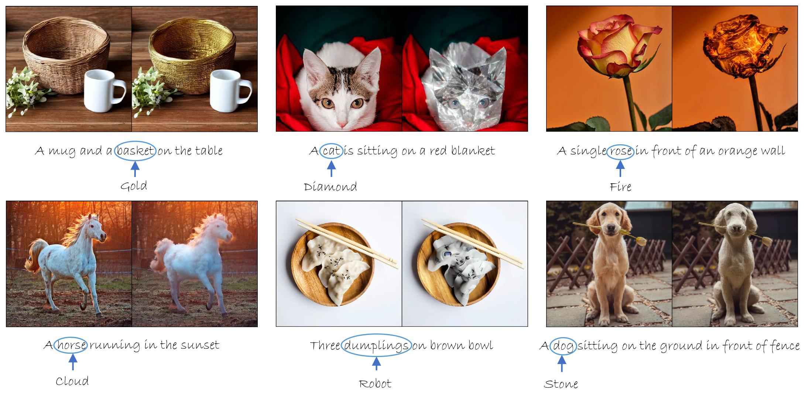
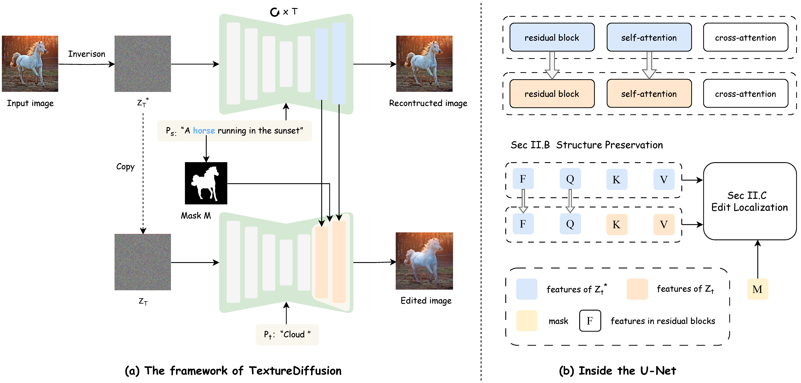
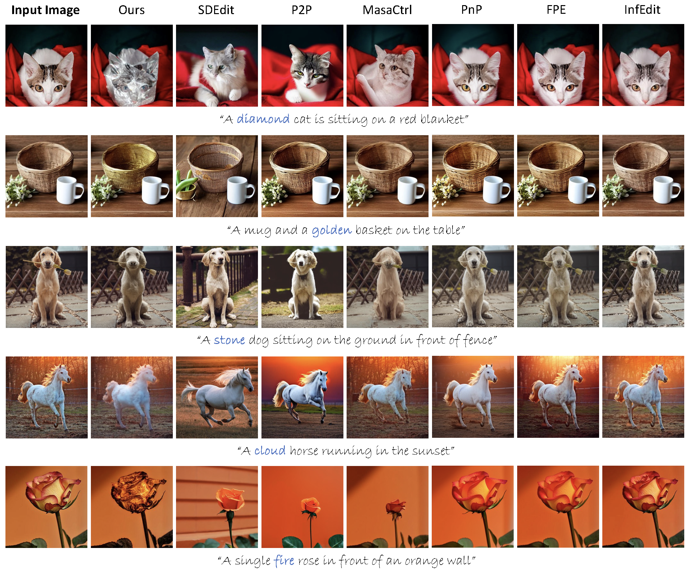
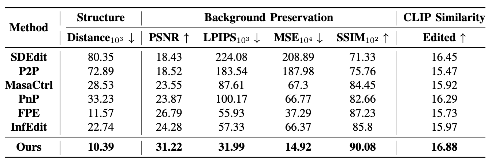

<p align="center">
  <h2 align="center"><strong>TextureDiffusion: Target Prompt Disentangled<br> Editing for Various Texture Transfer</strong></h2>

<p align="center">
    <a href="https://github.com/Sugewud">Zihan Su</a>,
    <a href="https://github.com/zhuang2002">Junhao Zhuang</a>,
    <a href="https://scholar.google.com.hk/citations?hl=zh-CN&user=fYdxi2sAAAAJ">Chun Yuan&#8224</a>
    <br>
    <b>Tsinghua University</b>
</p>

<div align="center">

[](https://arxiv.org/abs/2409.09610)

</div>


<p align="center">
    
</p>

## Release
- [09/16] Initial Preview Release 🔥 Coming Soon!
- [12/19] Official Release of Code 🔥 Available Now!

## Contents
- [Release](#release)
- [Contents](#contents)
- [🐶 Introduction](#-introduction)
- [💻 Installation](#-installation)
- [🚀 Usage](#-usage)
- [🙌🏻 Acknowledgement](#-acknowledgement)
- [📖 BibTeX](#-bibtex)

## 🐶 Introduction
Recently, text-guided image editing has achieved significant success. However, existing methods can only apply simple textures like wood or gold when changing the texture of an object. Complex textures such as cloud or fire pose a challenge. This limitation stems from that the target prompt needs to contain both the input image content and \<texture\>, restricting the texture representation. In this paper, we propose TextureDiffusion, a tuning-free image editing method applied to various texture transfer. 


<br><br> 



## 💻 Installation
It is recommended to run our code on a Nvidia GPU with a linux system. Currently, it requires around 13 GB GPU memory to run our method. 

Clone the repo:
```
git clone https://github.com/Sugewud/TextureDiffusion.git
cd TextureDiffusion
```

To install the required libraries, simply run the following command:
```
conda create -n TextureDiffusion python=3.8
conda activate TextureDiffusion
pip install -r requirements.txt
```


## 🚀 Usage

The notebook `main.ipynb` provides the editing samples.

**Note**: Within `main.ipynb`, you can set parameters such as `attention_step`, `attention_layer`, and `resnet_step`. We mainly conduct expriemnts on Stable Diffusion v1-4, while our method can generalize to other versions (like v1-5).

**Dataset**: In the quantitative experiments, the dataset is the editing type of changing material on [PIE-Bench](https://github.com/cure-lab/PnPInversion/tree/main). We find that some text prompts do not meet the standards for changing material. For example, the source prompt is "the 2020 honda hrx is driving down the road" and the target prompt is "the 2020 honda hrx is driving down the road [full of flowers]". 

So we modify prompt, and the modified file is `mapping_file_modified.json`. You need to use this file to replace `mapping_file.json` in PIE-Bench to perform quantitative experiments. In addition, we show the modified prompt in `modified_prompt.txt`.

## 🙌🏻 Acknowledgement
Our code is based on these awesome repos:
* [PnPInversion](https://arxiv.org/abs/2310.01506) [[code](https://github.com/cure-lab/PnPInversion/tree/main)]
* [MasaCtrl](https://arxiv.org/abs/2304.08465) [[code](https://github.com/TencentARC/MasaCtrl)]
* [PnP](https://arxiv.org/pdf/2211.12572) [[code](https://github.com/MichalGeyer/pnp-diffusers)]

## 📖 BibTeX
If you find our repo helpful, please consider leaving a star or cite our paper :)
```bibtex
@article{su2024texturediffusion,
  title={TextureDiffusion: Target Prompt Disentangled Editing for Various Texture Transfer},
  author={Zihan Su, Junhao Zhuang, Chun Yuan},
  journal={arXiv preprint arXiv:2409.09610},
  year={2024}
}
```
